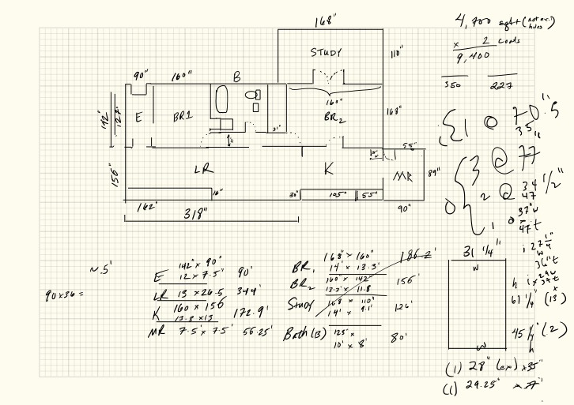

# One page, end to end

A single page from the corpus, with every stage shown: what each engine returned, what the
tiering decided, and the description that made it findable. Nothing here is reconstructed —
the two engine outputs are copied verbatim from the run.

The page is a hand-drawn floor plan with paint quantities worked out in the margin. It is
a fair example of the hard case: dense with information, almost none of it words.



## 1. What GoodNotes' handwriting recognition returned

288 characters, from the flattened export's text layer:

```
~
90x36= 4
,
700 sqft(autey
2 coats
110"=
9
400
,
50 227
11
BR1 ·
168"
I· 3
LR
1
I·
11 3114 i
.
90' BR
,
5 142"x90"
'I
Ex. 5
LR 13 X 26. 5 se 7. 5 x I-
7.5 55. 25' Bath (B) w
162"318"· sett
~&"
37"w
-1
Aft
```

## 2. What the Vision OCR pass returned

398 characters, from the rendered image:

```
142
90×36 =
156"
90"
160"
BR1
168"
STUDY
i6."
BR2
K
105"|55'
LR
318"
142" × 90'
E "2× 7.5" 90
LR 13 x24-5
344
160 x 156
172. 9'
BR,
BR_
Stuat
168" × 160"
14 x 13.3
13.3 x/11-8
MR 7.5× 75' 56.25
Bath (3) 125 x
4,700 sgt+(1ter)
2 coots
9,400
```

Vision does better on the printed-looking labels — it recovers `STUDY`, `BR2`, `K`, `MR`
and most of the dimension pairs, where the stroke recogniser produced `Stuat`-grade noise
or nothing. Neither produced a sentence.

## 3. What the tiering decided

```
gn  288 chars, validity 0.667
vi  398 chars, validity 0.429
vi - gn = 110      (screenshot needs >= 250)
                   -> needs reading
```

Worth pausing on `validity 0.667`. This page has six alphabetic tokens of three letters or
more — `sqft autey coats bath sett aft` — so a single token moves the score by 0.167. That
fragility is the whole of the recalibration note under finding 4 in
[FINDINGS.md](FINDINGS.md): at the old threshold of 0.65 this page was classified as
already-extracted and dropped from the reading queue.

## 4. What was written into the vault

> **Overview.** A floor plan for 1000 Smythe, labelled and costed out: rooms named, each
> one's dimensions converted to square feet in the table below, and paint quantities
> worked in the right margin. This is the page that turns the measurements into a number —
> 4,700 sq ft at two coats, 9,400.

**Rooms:** E (entry) · BR₁ · B (bath) · STUDY · BR₂ · LR · K · MR

| room | dims | sq ft |
|---|---|---|
| E | 142" × 90" → 12 × 7.5' | 90' |
| LR | 13 × 26.5' | 344' |
| K | 160 × 156" → 13.8 × 13' | 172.9' |
| MR | 7.5' × 7.5' | 56.25' |
| BR₁ | 168" × 160" → 14' × 13.3' | 186.2' |
| BR₂ | 160" × 142" → 13.3' × 11.8' | 156' |
| Study | 168" × 110" → 14' × 9.1' | 126' |
| Bath (B) | 125" × 10' × 8' | 80' |

*(right margin)* **4,700 sqft** *(not exterior holes)* × **2 coats** = **9,400** — 550 / 227

The address is invented. Everything else is what was written.

## 5. Why this is the argument

Search the vault for the words most likely to bring you back to this page:

| you would search for | in GoodNotes' output | in Vision's output | in the description |
|---|---|---|---|
| floor plan | no | no | **yes** |
| paint | no | no | **yes** |
| square feet | `sqft` | `sgt+` | **yes** |
| entry | no | no | **yes** |
| bedroom | `BR1` | `BR1` | **yes** |
| living room | `LR` | `LR` | **yes** |
| two coats | `2 coats` | `2 coots` | **yes** |

Both engines did their jobs. The page is a drawing, and the words you would use to find it
were never written on it, so there was nothing on the page for either engine to fail at.
The description supplies vocabulary that does not exist in the source — which is the whole
of finding 6, and the reason extraction alone leaves a notebook full of dead pages.

Note also what the description carries that no character count can: the structure. That
the areas table converts inches to feet, that the right margin is a trim schedule, that
this page is the *costing* pass over a plan drawn on the page before it. Structure is most
of what a diagram means, and neither engine is built to report it.
